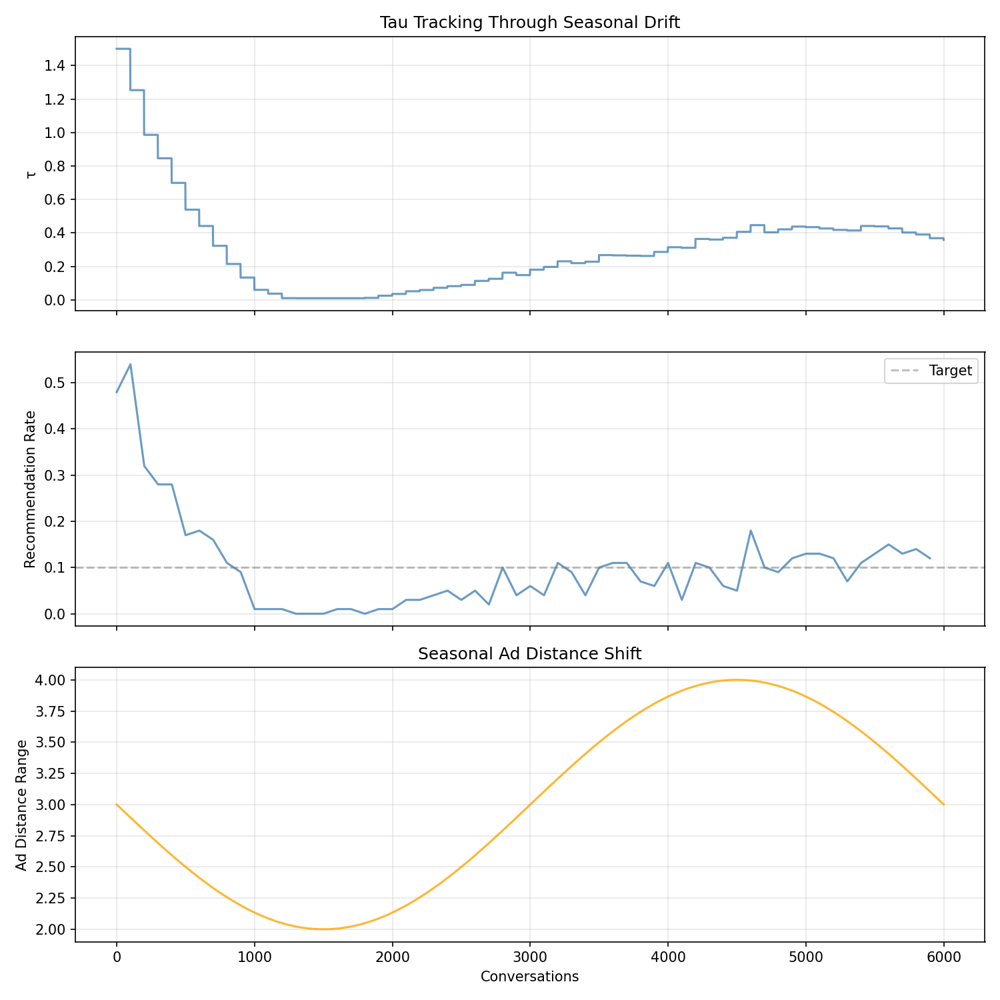
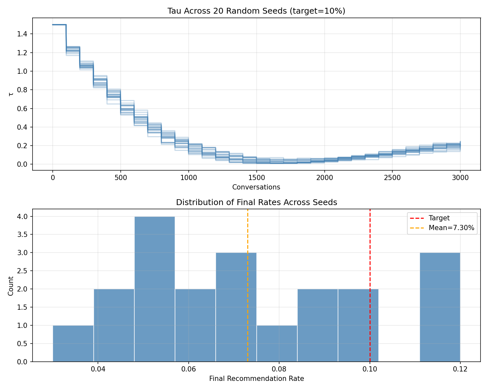

# tau-controller

PID controller for τ — the publisher's relevance threshold in a [power-diagram ad auction](https://kimjune01.github.io/set-it-and-forget-it).

The publisher sets one number: what percentage of conversations should include a recommendation. The controller adjusts τ (a distance threshold in embedding space) to hit that target.

## How it works

- **Per-conversation, not per-turn.** A conversation is a series of turns. One recommendation per conversation, max.
- **PID feedback loop.** If the recommendation rate exceeds the target, τ tightens. If it's below, τ loosens. Integral and derivative terms handle drift and sudden changes.
- **Runs on the publisher's infrastructure.** No exchange dependency.

## Simulation results

`uv run --with matplotlib simulate.py` runs 5,000 conversations across four target rates and a shock scenario.

### Convergence

The controller converges to the target recommendation rate from an arbitrary starting τ:

| Target | Equilibrium τ | Final τ | Final Rate | Error |
|--------|--------------|---------|------------|-------|
| 5% | 0.150 | 0.105 | 7% | 0.020 |
| 10% | 0.300 | 0.319 | 12% | 0.020 |
| 20% | 0.600 | 0.624 | 20% | 0.000 |
| 30% | 0.900 | 0.910 | 26% | 0.040 |


### Shock recovery

When a new advertiser category enters (ad distances suddenly halve), τ tightens to maintain the target rate:


### Seasonal drift

Ad distance distributions shift with seasons (more commercial queries in Q4, fewer in Q1). The integral term tracks the slow drift:



### Robustness across seeds

Same scenario (10% target) run across 20 random seeds. Mean final rate: 7.3% (target: 10%). All runs converge to the same neighborhood:



## Privacy and security

This code is designed for HIPAA/FTC-concerned publishers.

- **No PII/PHI in, no PII/PHI out.** The code only processes distances (floats) and opaque conversation IDs (strings). It never sees embeddings, user data, or content.
- **Conversation IDs must be opaque tokens** (UUIDs), never emails, patient IDs, or anything linkable to an individual.
- **TTL eviction.** Conversations are automatically evicted after `ttl_seconds` (default: 1 hour) to prevent stale state from accumulating in memory.
- **Hard cap.** `max_conversations` (default: 100,000) prevents memory exhaustion. Oldest conversations are evicted when the cap is hit.
- **Thread-safe.** All shared state is protected by locks for concurrent request handling.
- **Anti-windup.** The PID integral is clamped to `integral_max` to prevent runaway corrections from adversarial spikes.
- **No network, no disk, no logging.** Pure computation. Nothing leaves the process.

## Usage

```python
from pid import TauController, RecommendationGate

controller = TauController(target_rate=0.10)  # 10% of conversations
gate = RecommendationGate(controller=controller)

# On each conversation start — use opaque tokens, never PII
gate.tracker.start(conversation_id)

# On each turn, check whether to show a recommendation
if gate.should_recommend(conversation_id, best_ad_distance):
    show_recommendation()

# On conversation end
gate.on_conversation_end(conversation_id)
```

## Interactive demo

Open `demo.ipynb` to try it yourself. Change the target rate, re-run, and see how τ adjusts.

```
uv run --with matplotlib --with jupyter jupyter notebook demo.ipynb
```

## Tests

```
uv run --with pytest pytest test_pid.py -v
```

## License

MIT
